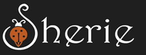

<div align="center">
  
  
  
  
 
  <br />
  <br />
  
  

  <h2 align="center">Sherie - Personal portfolio</h2>

  This website is fully responsive personal portfolio, <br />Responsive for all devices, built using HTML, CSS, and JavaScript.

  <a href="https://ilyladybugz.github.io/sherie-portfolio/"><strong>➥ Live Demo</strong></a>

</div>

<br />

### Demo Screeshots


### Prerequisites

Before you begin, ensure you have met the following requirements:

* [Git](https://git-scm.com/downloads "Download Git") must be installed on your operating system.

### Run Locally

To run **sherie-portfolio** locally, run this command on your git bash:

Linux and macOS:

```bash
sudo git clone https://github.com/ILYladybugz/sherie-portfolio.git
```

Windows:

```bash
git clone https://github.com//ILYladybugz/sherie-portfolio.git
```

### Contact

If you want to contact me you can reach me at [LinkedIn](https://www.linkedin.com/in/sherie-kimble-4309664/).

### License

This project is **free to use** and does not contains any license.
